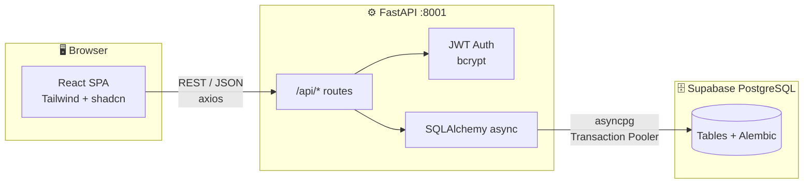
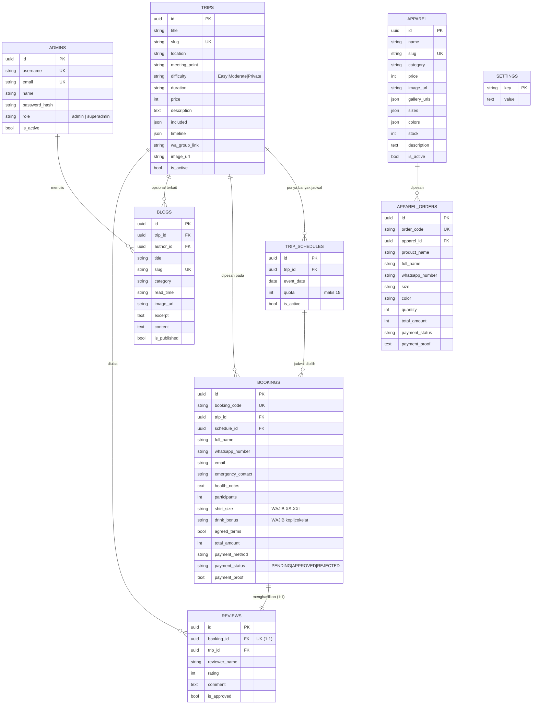
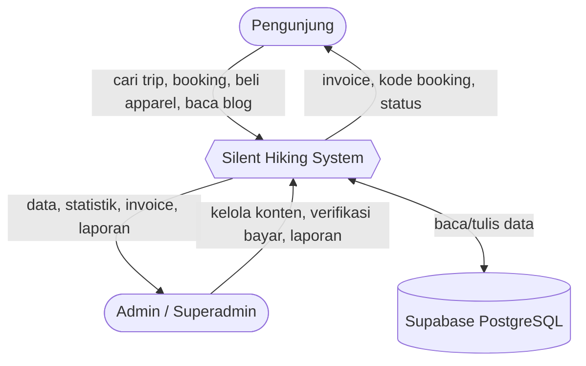
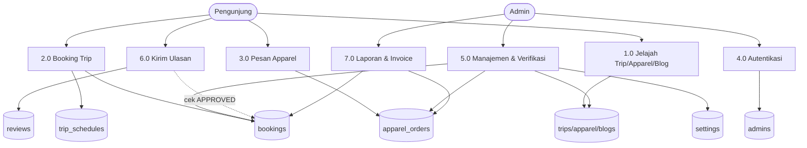
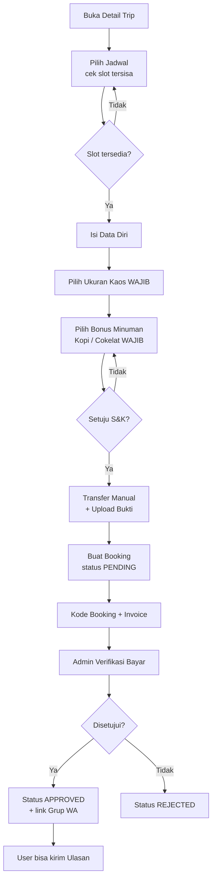
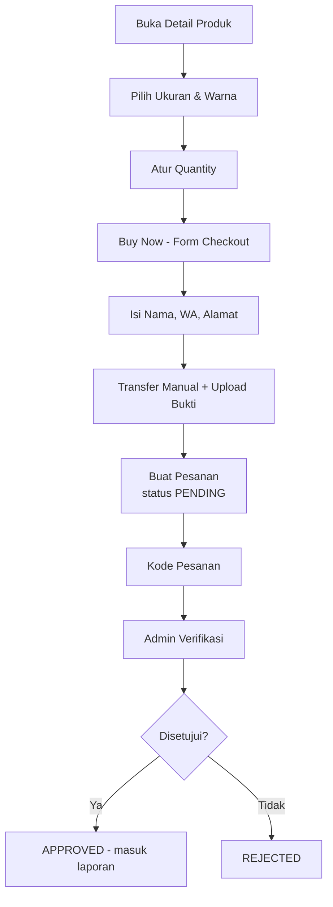
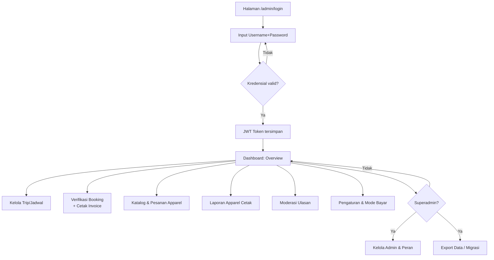

# 🌲 Silent Hiking Indonesia

> **Walk Slowly. Be Present. Feel More.**
> Platform full-stack untuk **booking trip silent hiking**, **toko apparel/gear**, dan **journal/blog**, dilengkapi **Dashboard Admin** lengkap (multi-admin, manajemen booking, status pembayaran, cetak invoice & laporan).

Dibangun dengan **React + Tailwind CSS** (frontend), **FastAPI/Python** (backend), dan **Supabase (PostgreSQL)** sebagai database relasional. Skema dikelola dengan **Alembic** (versioned & reversible) sehingga portabel untuk di-deploy ulang / migrasi ke PostgreSQL self-hosted.

---

## 📑 Daftar Isi
1. [Fitur Utama](#-fitur-utama)
2. [Arsitektur & Tech Stack](#-arsitektur--tech-stack)
3. [Struktur Folder](#-struktur-folder)
4. [Instalasi & Menjalankan](#-instalasi--menjalankan)
5. [Environment Variables](#-environment-variables)
6. [Database & Migrasi (Alembic)](#-database--migrasi-alembic)
7. [ERD (Entity Relationship Diagram)](#-erd-entity-relationship-diagram)
8. [DFD (Data Flow Diagram)](#-dfd-data-flow-diagram)
9. [Flowchart Fitur](#-flowchart-fitur)
10. [Ringkasan API Endpoint](#-ringkasan-api-endpoint)
11. [Kredensial Admin Default](#-kredensial-admin-default)

---

## ✨ Fitur Utama

### Sisi Publik (Pengunjung)
- **Landing page** editorial bertema hutan/mindful (hero, filosofi, trip terdekat, koleksi apparel, testimoni, journal, FAQ, kontak).
- **Daftar & Detail Trip** — 1 trip memiliki **banyak jadwal**, kuota **maks 15 orang per jadwal**, slot realtime.
- **Alur Booking Trip (4 langkah)**:
  1. Pilih jadwal (menampilkan slot tersisa).
  2. Data diri + **wajib pilih ukuran kaos (XS–XXL)** + **wajib pilih bonus minuman (Kopi / Cokelat)**.
  3. Pembayaran — **manual transfer** (detail rekening + upload bukti transfer).
  4. Konfirmasi + **kode booking unik** + **invoice** siap cetak.
- **Toko Apparel** (terpisah dari booking trip) — katalog + filter kategori, **detail produk dengan kustomisasi ukuran & warna**, quantity, checkout manual transfer, kode pesanan.
- **Journal/Blog** — daftar artikel + filter kategori, halaman detail artikel.
- **Invoice & Status** — cek booking via kode, cetak invoice, dan **kirim ulasan** (hanya untuk booking yang sudah **APPROVED**).

### Dashboard Admin
- **Login JWT** (multi-admin, peran `admin` & `superadmin`).
- **Overview** — statistik booking, pendapatan trip & apparel, ulasan pending.
- **Kelola Trip** — CRUD trip + banyak jadwal (kuota maks 15), termasuk daftar fasilitas & timeline.
- **Manajemen Booking** — filter status, **edit data pemesan**, ubah **status pembayaran** (PENDING/APPROVED/REJECTED), lihat bukti transfer, **cetak invoice otomatis**.
- **Katalog Apparel** — CRUD produk (ukuran, warna, galeri, stok).
- **Pesanan & Laporan Apparel** — kelola status pesanan + **laporan agregat (per produk & ukuran) siap cetak**.
- **Blog/Journal** — CRUD artikel.
- **Ulasan** — moderasi ulasan yang **terikat pada booking pengguna** (anti ulasan palsu).
- **Pengaturan** — brand (nama, logo, warna, hero), **mode pembayaran**, rekening bersama, biaya proses, kontak.
- **Admin & Peran** — (khusus `superadmin`) tambah/hapus admin, atur peran.
- **Database & Migrasi** — info engine/versi/revisi Alembic + **export seluruh data (JSON)** untuk backup/migrasi.

---

## 🏗 Arsitektur & Tech Stack

| Layer | Teknologi |
|------|-----------|
| Frontend | React 19, React Router, Tailwind CSS, shadcn/ui, lucide-react, sonner, axios |
| Backend | FastAPI, SQLAlchemy 2 (async), asyncpg, Alembic, PyJWT, bcrypt |
| Database | Supabase (PostgreSQL, via Transaction Pooler) |
| Auth | JWT (Bearer token) + bcrypt password hashing |



---

## 📂 Struktur Folder

```
/app
├── backend
│   ├── server.py          # FastAPI app + semua route
│   ├── database.py        # Engine & session async
│   ├── models.py          # Model SQLAlchemy (tabel)
│   ├── auth.py            # JWT, bcrypt, guard peran
│   ├── seed.py           # Seed admin + data contoh
│   ├── alembic/          # Migrasi database
│   └── .env              # ENV backend (DATABASE_URL, JWT_SECRET, ...)
└── frontend
    ├── src
    │   ├── App.js             # Routing
    │   ├── context/           # Auth & Settings context
    │   ├── lib/               # api client, format
    │   ├── components/site/   # Navbar, Footer, TripCard
    │   └── pages/            # Landing, Trip, Shop, Journal, Admin, ...
    └── .env                  # REACT_APP_BACKEND_URL
```

---

## 🚀 Instalasi & Menjalankan

### Prasyarat
- **Node.js 18+** & **Yarn**
- **Python 3.11+**
- Akun **Supabase** (gratis) → ambil **Transaction Pooler connection string** (port `6543`)

### 1) Backend
```bash
cd backend

# buat virtualenv (opsional)
python -m venv venv && source venv/bin/activate

# install dependency
pip install -r requirements.txt

# konfigurasi .env (lihat bagian Environment Variables)
# jalankan migrasi untuk membuat semua tabel
alembic upgrade head

# jalankan server (dev)
uvicorn server:app --host 0.0.0.0 --port 8001 --reload
```
> Saat pertama start, `seed.py` otomatis membuat admin default + data contoh (trip, apparel, blog, settings).

### 2) Frontend
```bash
cd frontend
yarn install
# set REACT_APP_BACKEND_URL di frontend/.env
yarn start          # dev  → http://localhost:3000
# atau
yarn build          # produksi (folder build/)
```

### 3) Buka aplikasi
- Situs publik: `http://localhost:3000`
- Dashboard admin: `http://localhost:3000/admin/login`

> **Catatan platform Emergent:** backend berjalan di `0.0.0.0:8001` dan frontend di `3000` melalui supervisor. Semua route backend memakai prefix `/api`. Frontend selalu memanggil `REACT_APP_BACKEND_URL`.

---

## 🔐 Environment Variables

### `backend/.env`
```env
DATABASE_URL="postgresql://postgres.<ref>:<password>@aws-0-<region>.pooler.supabase.com:6543/postgres"
JWT_SECRET="<random-64-hex>"
ADMIN_EMAIL="programingdistributor@gmail.com"
ADMIN_USERNAME="admin"
ADMIN_PASSWORD="<password-admin>"
FRONTEND_URL="https://<frontend-url>"
```
> Jika password mengandung karakter khusus (`#`, `,`, `@`, dll), **URL-encode** bagian password (mis. `#` → `%23`, `,` → `%2C`).

### `frontend/.env`
```env
REACT_APP_BACKEND_URL=https://<backend-public-url>
```

---

## 🗃 Database & Migrasi (Alembic)

```bash
cd backend

alembic revision --autogenerate -m "pesan perubahan"   # buat migrasi dari perubahan model
alembic upgrade head                                    # terapkan migrasi
alembic downgrade -1                                    # rollback 1 langkah
alembic current                                         # cek revisi aktif
```
- Skema di-track & reversible → aman untuk **deploy ulang** / **migrasi ke PostgreSQL self-hosted (VPS)**.
- **Export data**: Dashboard Admin → **Database** → *Export Semua Data (JSON)* untuk backup/portabilitas.

---

## 🧩 ERD (Entity Relationship Diagram)



---

## 🔄 DFD (Data Flow Diagram)

### DFD Level 0 — Konteks


### DFD Level 1 — Proses Utama


---

## 🧭 Flowchart Fitur

### 1) Alur Booking Trip


### 2) Alur Pesan Apparel (toko terpisah)


### 3) Alur Admin (Login → Kelola)


---

## 🔌 Ringkasan API Endpoint

Semua endpoint diawali `/api`. Endpoint admin butuh header `Authorization: Bearer <token>`.

### Publik
| Method | Path | Deskripsi |
|-------|------|-----------|
| GET | `/settings/public` | Pengaturan brand/bank/kontak |
| GET | `/trips` | Daftar trip aktif + slot |
| GET | `/trips/{slug}` | Detail trip |
| POST | `/bookings` | Buat booking |
| GET | `/bookings/{code}` | Lihat booking/invoice |
| GET | `/apparel` | Daftar produk |
| GET | `/apparel/{slug}` | Detail produk |
| POST | `/apparel-orders` | Buat pesanan apparel |
| GET | `/apparel-orders/{code}` | Lihat pesanan |
| GET | `/blogs` · `/blogs/{slug}` | Daftar & detail artikel |
| GET | `/reviews` | Ulasan tampil |
| POST | `/reviews` | Kirim ulasan (butuh booking APPROVED) |

### Auth
| Method | Path |
|-------|------|
| POST | `/auth/login` |
| GET | `/auth/me` |
| POST | `/auth/logout` |

### Admin
| Resource | Endpoint |
|----------|----------|
| Overview | `GET /admin/overview` |
| Trips | `POST/PUT/DELETE /admin/trips[/{id}]` |
| Bookings | `GET /admin/bookings` · `PUT/DELETE /admin/bookings/{id}` |
| Apparel | `POST/PUT/DELETE /admin/apparel[/{id}]` |
| Apparel Orders | `GET /admin/apparel-orders` · `PUT /admin/apparel-orders/{id}` |
| Report | `GET /admin/reports/apparel` |
| Blogs | `POST/PUT/DELETE /admin/blogs[/{id}]` |
| Reviews | `GET /admin/reviews` · `PUT/DELETE /admin/reviews/{id}` |
| Settings | `GET/PUT /admin/settings` |
| Admins (superadmin) | `GET/POST/PUT/DELETE /admin/admins[/{id}]` |
| Database | `GET /admin/db-info` · `GET /admin/export` |

---

## 🔑 Kredensial Admin Default

| Field | Nilai |
|------|-------|
| URL | `/admin/login` |
| Username | `admin` |
| Password | *(sesuai `ADMIN_PASSWORD` di `backend/.env`)* |
| Role | `superadmin` |

> ⚠️ Segera ganti password default setelah login pertama (menu **Admin & Peran**).

---

© Silent Hiking Indonesia — dibangun dengan ketenangan. 🌿
